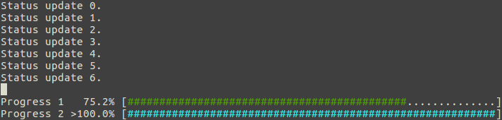

# CLIProgressbar
A Progressbar for commandline applications using ANSI escape codes.

  

## Requirements
+ ANSI-compatible terminal
+ Make
+ CMake
+ Python (2.7) header files (e.g. python-dev on debian)
+ SWIG

## Fetures
+ A progressbar for commandline applications.
+ Standard output can be used a normal without overwriting the progressbar.
+ Custom progress text and percent done.
+ Custom bar style including bar edge, fill, empy and last-filled characters.
+ Multiple bar color styles.
+ Demos for Python and C.

### Supported languages
+ ANSI C (C89 and above)
+ C++
+ Python 2.7 (bindings by SWIG)

### Supported bar color styles
+ No color
+ One color (green)
+ Color by progress (red for low, yellow for medium, green for high)